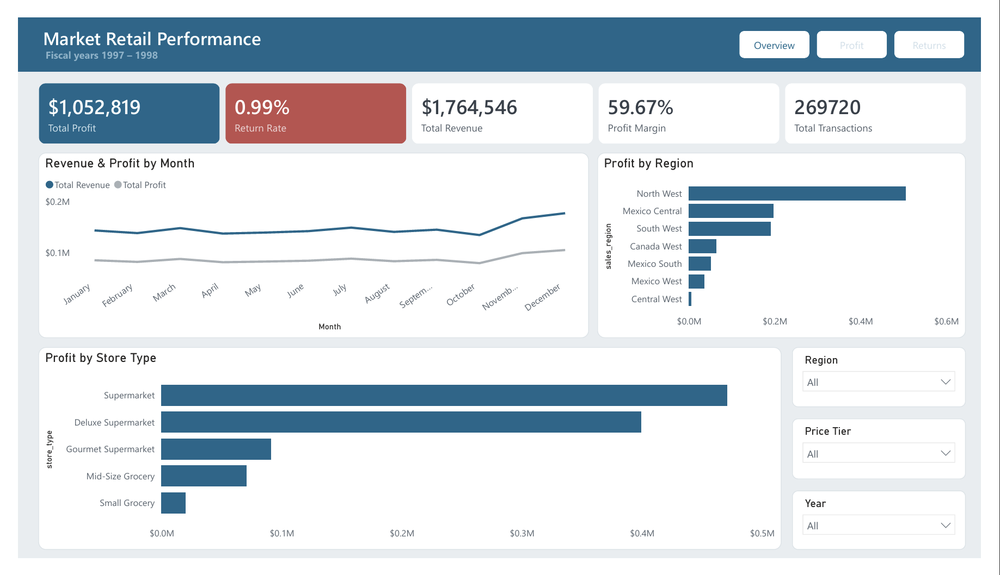
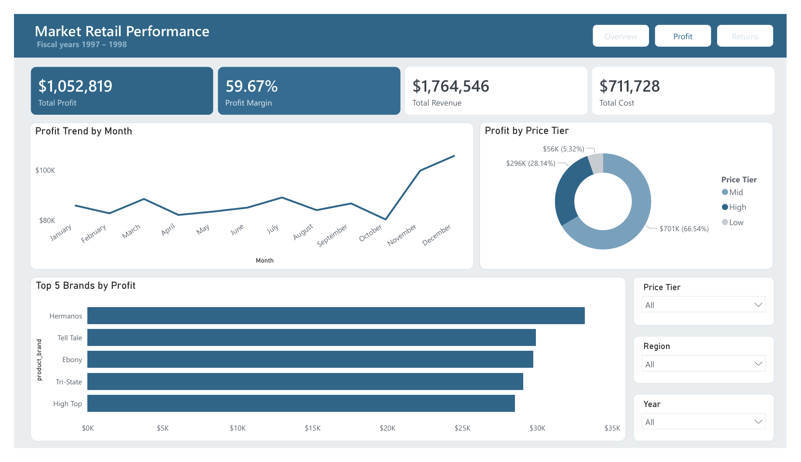
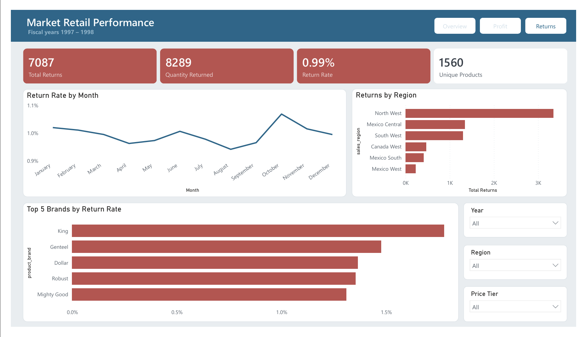

# 📊 Market Retail Performance — Power BI Dashboard

> An end-to-end business intelligence report analysing two years of retail sales and returns data (**fiscal years 1997–1998**), built in Power BI Desktop. From raw CSVs to a navigable, three-page executive dashboard.



---

## 🎯 Project Overview

**Business question:** *Did this retail business perform well across 1997–1998 — and if so, where is it making money, and where is it losing it to returns?*

This report was built as the capstone project for the **Professional Diploma in Business Intelligence and Data Analytics**. It demonstrates a complete BI workflow: data extraction and shaping, dimensional modelling, DAX measures, and dashboard design following recognised data-visualisation principles.

---

## 🛠️ Tools & Skills Demonstrated

- **Power BI Desktop** — report authoring
- **Power Query (M)** — data extraction, cleaning, and shaping
- **DAX** — measures, calculated columns, and time intelligence
- **Data Modelling** — star schema with a snowflake dimension
- **Dashboard / UX Design** — selective colour, visual hierarchy, navigation

---

## 🗂️ Data Model

A **star schema** with one snowflake arm (Regions → Stores), comprising 7 tables:

- **5 lookup tables:** Customers, Products, Stores, Regions, Calendar
- **2 fact tables:** Transaction_Data (~270,000 rows, combined from 1997 + 1998 files), Return_Data
- **Dual date relationship:** an *active* relationship on `transaction_date` and an *inactive* one on `stock_date`
- All relationships one-to-many, single-direction filters flowing from lookup → fact tables

---

## 🔧 Data Preparation (Power Query)

- Merged columns → `full_name`, `full_address`
- Extracted → `birth_year`, `area_code`
- Conditional column → `has_children`
- Calculated → `discount_price` (90% of retail, rounded)
- Replaced nulls with 0 in `recyclable` and `low_fat`
- Combined two yearly transaction CSVs from a single folder source
- Built a full date table with `Start of Week` (Sunday), `Name of Day`, `Name of Month`, `Quarter of Year`, `Year`

## 🧮 Calculated Columns & Measures

**Calculated columns:** `Weekend`, `Priority`, `Price_Tier`

**12 DAX measures** (validated against expected values):

| Measure | Value |
|---|---|
| Quantity Sold | 833,489 |
| Total Transactions | 269,720 |
| Total Revenue | $1,764,546 |
| Total Cost | $711,728 |
| Total Profit | $1,052,819 |
| Profit Margin | 59.67% |
| Unique Products | 1,560 |
| Total Returns | 7,087 |
| Quantity Returned | 8,289 |
| Return Rate | 0.99% |
| YTD Revenue, Last Month (Transactions / Revenue / Profit / Returns) | time-intelligence |

*Revenue uses an iterator (`SUMX` with `RELATED`); YTD and Last Month use the Calendar date table for time intelligence.*

---

## 📑 Dashboard Pages

### 1. Overview — *Performance at a glance*
Headline KPIs, monthly revenue & profit trend, profit by region and store type.


### 2. Profit Deep Dive — *Where the money comes from*
Profit trend, profit by price tier, and top brands by profit.


### 3. Returns Deep Dive — *Where we lose money*
Return-rate trend, returns by region, and brands with the highest return rates.


---

## 💡 Key Insights

- **Strong profitability:** ~60% profit margin — excellent for retail.
- **Growth:** revenue and profit both rose across the two-year period.
- **Premium products lead:** high-tier products generate **66.5%** of all profit.
- **Healthy returns:** return rate under **1%**, indicating high customer satisfaction.
- A small group of brands shows elevated return *rates* — flagged for quality/supplier review.

---

## 🎨 Design Approach

- Custom theme (`theme/Market_Retail_Theme.json`) enforcing a **petrol-blue / muted-coral / gray** palette
- "Gray is your friend" — colour used *selectively* to highlight, never decoratively
- Consistent colour language across pages (blue = profit, coral = returns)
- Visual hierarchy, dropdown slicers, and page-navigation buttons

---

## ▶️ How to Open

1. Download **`Market_Report.pbix`**
2. Open it in **[Power BI Desktop](https://powerbi.microsoft.com/desktop/)** (free)
3. Use the navigation buttons (top-right) to move between pages, and the slicers (right) to filter

---

## 📁 Repository Structure

```
market-retail-performance-powerbi/
├── README.md
├── Market_Report.pbix
├── .gitignore
├── assets/
│   ├── overview-page.png
│   ├── profit-page.png
│   └── returns-page.png
└── theme/
    └── Market_Retail_Theme.json
```

---

## 👤 Author

**[Your Name]**
- LinkedIn: [your-linkedin-url]
- GitHub: [your-github-username]

## 📄 Data & License

Built on the publicly available **FoodMart** retail sample dataset, used here for educational purposes. This project is shared for portfolio demonstration.
